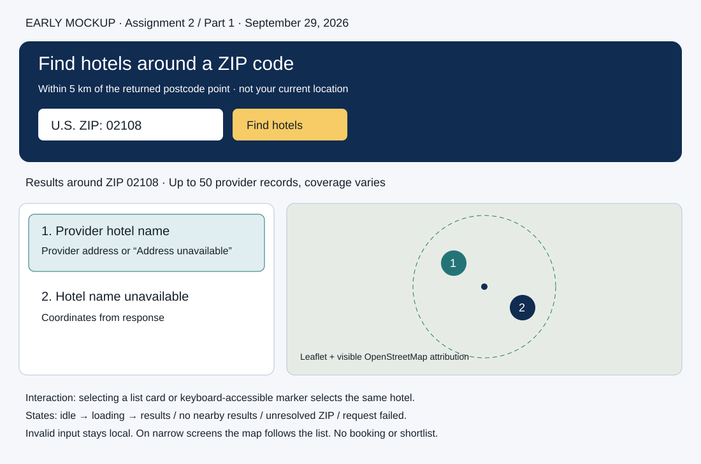

# Assignment 2 — Part 1: Live Hotel Search and Map

**Observation date:** September 29, 2026. **Scope:** Part 1 only. No persistent shortlist was implemented.

## Project access and configuration

Repository: [milestudor/expedia_project](https://github.com/milestudor/expedia_project).

**Assessed commit: pending student review.** The implementation is in the local working tree; existing base commit is `50c55cc5e7f7906208748aca750815c8c4193643` and does **not** contain this new work. AGENTS.md prohibits committing or pushing before manual review. Replace this field with the reviewed implementation commit before submission.

**Access status:** new artifacts are local and are not published yet. The prior report described the repository as private; instructor access has not been verified. Before submitting this report, publish/link the reviewed artifacts in an instructor-accessible location without an additional access request. Do not submit this draft with pending access/commit fields.

Requirements: Python 3.11+, Node 20.19+ or 22.12+, and a Geoapify API key. From the repository root:

```sh
python3 -m venv backend/.venv
backend/.venv/bin/python -m pip install -r backend/requirements.txt
cd frontend
npm ci
cd ..
```

Create the root `.env` from `.env.example` only if it does not already exist. Set `GEOAPIFY_API_KEY` to your own key; never commit it. Start the backend and frontend in separate terminals:

```sh
backend/.venv/bin/python -m uvicorn backend.app.main:app --reload --port 8000
```

```sh
cd frontend
npm run dev
```

Open `http://127.0.0.1:5173`. Restart the backend after changing `.env`. Backend environment variables take precedence over the file. The browser receives no Geoapify credential; public OpenStreetMap tiles require no key. [README](README.md) contains full startup and verification instructions.

## Research notes and design

Research was performed before the discovery interface was implemented. [Detailed research notes](docs/assignment-2-part-1/research.md).

| Sources | Observation and resulting decision |
| --- | --- |
| [Expedia Hotels](https://www.expedia.com/Hotels) | Destination-first discovery is useful. Booking offers/dates imply inventory that this provider does not supply; omit those from the live interface. |
| [Google Travel](https://www.google.com/travel/hotels) | Research reader redirected to an unsupported-browser page. Interactive behavior could not be evaluated; no synchronization claim is attributed to it. |
| [Geoapify geocoding](https://apidocs.geoapify.com/docs/geocoding/) | Use postcode lookup and U.S. country filter, then verify exact requested postcode/country and valid coordinates before querying hotels. |
| [Geoapify Places](https://apidocs.geoapify.com/docs/places/) | Use `accommodation.hotel`, `circle:longitude,latitude,5000`, proximity bias and limit 50. Coverage is variable, so explicitly avoid exhaustive-inventory claims. |
| [Leaflet documentation](https://leafletjs.com/reference) | Use numbered keyboard-focusable markers, safe text popups and a shared selected provider ID. Explicit Enter/Space handling was necessary for list synchronization. |
| [OSM tile policy](https://operations.osmfoundation.org/policies/tiles/), [Geoapify pricing](https://www.geoapify.com/pricing/), [terms](https://www.geoapify.com/terms-and-conditions/) | Visible attribution, ordinary browser tile caching, modest explicit-submit request volume, no automatic retries or bulk tile download. No paid plan is required for this classroom demonstration. |

The research-access limitations and follow-up Booking.com access attempt are documented in the detailed notes rather than presented as observed interactions.

## Early mockup and implementation



The mockup was created before the new discovery view. It proposes a ZIP search, numbered list and map, returned-center circle, missing-field labels and distinct request states. The final design retains that behavior with a larger introductory area and separate navigation to the previous sample application. On narrow screens, list and map stack vertically.

FastAPI controls ZIP validation and HTTP error mapping. `zip_lookup.py` verifies the requested location, and `hotel_search.py` requests/normalizes hotels. Vue controls loading, result/error state and one selected provider ID. Leaflet renders those hotel coordinates and emits selection. [MVC responsibilities](AGENTS.md), [design and data contract](docs/design.md).

The original sample application is retained at `/sample-stays`; it is separate from the live search. No live prices, ratings, rooms, booking confirmations or shortlist controls are fabricated. Missing names and addresses have honest labels. Malformed provider identifiers/coordinates fail visibly rather than silently producing an empty success.

## Screen-recorded demonstration

[Part 1 demo video — 21.92 seconds, WebM](docs/assignment-2-part-1/part-1-demo.webm).

This silent browser capture shows invalid ZIP feedback, a **live** `02108` search, list-to-map selection and keyboard marker-to-list selection. Subsequent empty/unresolved/failure demonstrations are explicitly labeled simulations. A labeled replay of the captured live response checks narrow-screen layout; a brief original-sample regression check concludes the video. [Demo script](docs/assignment-2-part-1/demo-script.md).

The local link must be replaced or published with instructor access after student review.

## Verification record

Live ZIP tested: **02108**, September 29, 2026, approximately **09:44 ET**. Returned Boston postcode point: **42.357581412, -71.065946589**. Observed 50 hotels, reaching the configured cap; this count is not a future expectation or exhaustive inventory.

| Input/action | Expected | Observed |
| --- | --- | --- |
| Submit `1234` | Local invalid-input feedback | Passed |
| Submit `02108` | Loading, intended U.S. ZIP, 5 km provider query | HTTP 200, Boston center and 50 records |
| Missing provider name | Honest fallback | “Hotel name unavailable” |
| Select first card | Matching map marker | Highlight and matching popup |
| Enter on marker 2 | Matching list selection | Beacon Hill Hotel and Bistro selected |
| Simulated empty / unresolved / failed response | Distinct messages; failures never called empty success | All passed |
| 390px viewport | List/map stack, no horizontal overflow | Passed using labeled replay |
| Existing sample hotel search | Preserved earlier behavior | Harbor Lantern results passed |
| Backend automated checks | Original behavior, exact ZIP gating, provider normalization and errors | 60 passed |
| Frontend automated checks | Existing views, validation, state transitions, shared selection | 24 passed |
| Lint / production build | Successful | Passed |

[Full expected-versus-observed record and corrections](docs/assignment-2-part-1/verification.md), [browser observations](docs/assignment-2-part-1/browser-verification.json), [live screenshot](docs/assignment-2-part-1/live-results.png), [map selection](docs/assignment-2-part-1/map-selection.png).

Repeat checks:

```sh
backend/.venv/bin/python -m pytest backend/tests -q
cd frontend
npm test
npm run lint
npm run build
```

Remaining limits: one live ZIP verified; other edge states simulated; no pagination beyond 50; provider coverage and tile/network availability vary. A tile-failure message is implemented but not deliberately exercised in the recorded run. Tests simulate provider 429 rather than exhausting quota. One existing anyio deprecation warning remains.

## AI disclosure and evidence log

OpenAI Codex desktop, GPT-6 agent session, was used for interpreting the assignment, primary-source research, mockup creation, implementation, tests, browser automation and documentation. The exact model deployment build identifier is not exposed in the session. Web tools retrieved sources; Playwright with installed Chrome verified the UI; the separately approved FFmpeg v1011 helper recorded it. No subagents were used.

Selected user prompt: “please view the following instructions and only complete what is asked for part 1 please.” The student separately approved Leaflet 1.9.4 and the video helper. [Selected prompts and linked changes](prompts/selected.md) records those decisions.

A failed implementation approach was corrected: listening only for marker clicks left keyboard Enter opening a popup without selecting the list entry. Explicit Enter/Space handling fixed it, and the browser rerun passed. Environment revisions (wrong virtual environment, network-restricted install, unavailable bundled browser) are also recorded. The student must manually review the work and browser results before the assessed commit and publication.
